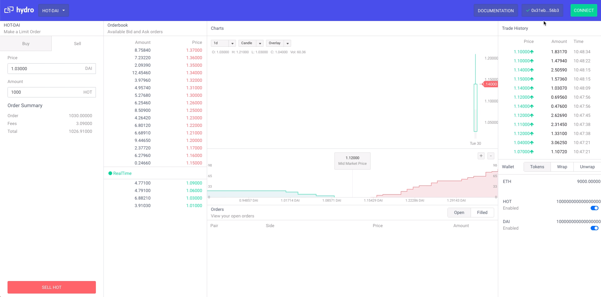

## Hydro-Dex

# Overview

This repository provides a basic scaffold for building a Decentralized Exchange (DEX) on the Ethereum blockchain. Follow the guides to learn how to:

- Setup an open source, fully modifyable decentralized exchange on your local server
- Send Ethereum transactions
- Make changes to the front-end UI
- Customize all parts of a DeFi application: change fees, parameters, adding markets, etc.

